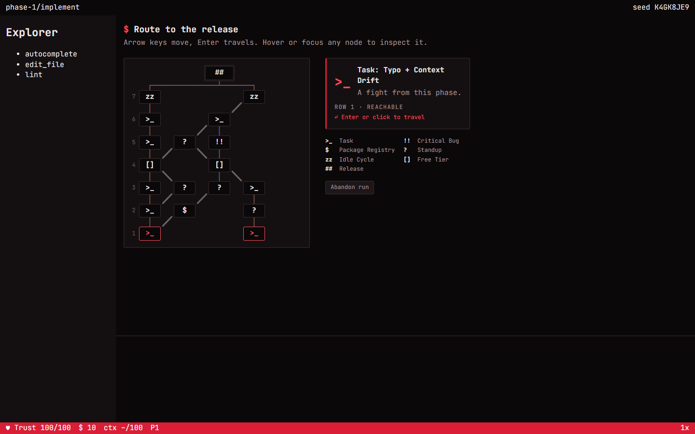
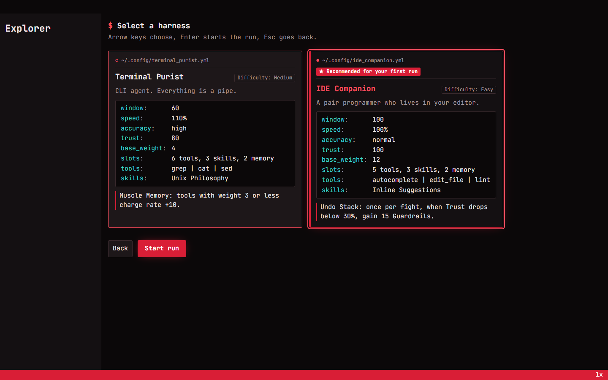

# Loop Engineer

A browser roguelite auto-battler about an AI agent stuck in an engineering loop —
built almost entirely by AI agents working in a self-maintaining harness.

You play an agent. Pick a **harness** (model, tools, skills), choose a **system prompt**,
then fight your way through a map of tasks, standups and package registries to ship
the release before someone presses Ctrl+C. Fights resolve automatically; your decisions
happen between them. The core tension is the **context window**: every tool fills it,
enemies inject noise, and an overflowing context forces a costly compaction.



> **Status:** work in progress, milestone M1 (vertical slice: phase 1 "Implement").
> A full run from title to boss is playable. See [forge/BOARD.md](forge/BOARD.md) for
> live progress and [docs/game/milestones.md](docs/game/milestones.md) for the roadmap
> (M1 slice → M2 full content → M3 polish).

## Quick start

Requires Node 24 (TypeScript runs natively, no build step for tools).

```sh
npm install
npm run dev          # play in the browser (http://localhost:5173)
```

`?sandbox` on the dev server opens a combat sandbox to replay single fights.

| Command | What it does |
|---|---|
| `npm run check` | The single quality gate: typecheck, Biome, Vitest + coverage, build, Playwright e2e, harness lint |
| `npm test` | Unit and property tests (Vitest, fast-check) |
| `npm run e2e` | Browser tests against the production build (Playwright) |
| `npm run balance` | Bots play thousands of seeded runs and report win rates |
| `npm run golden:update` | Regenerate the golden combat logs after an intended sim change |

## How the game is built

- **Deterministic simulation** (`src/sim`): integer-only maths, a seeded forkable RNG,
  no clock or DOM. A fight resolves instantly into an **event log**; the same seed always
  produces a byte-identical log.
- **Run reducer** (`src/run`): the whole run is a pure reducer over serializable actions,
  so a save is just *seed + setup + action log* and can be replayed exactly.
- **Content as typed data** (`src/content`): tools, enemies, events and lessons are
  TypeScript data with a small trigger/effect DSL; tooltips are generated from the data.
- **UI** (`src/ui`): Preact + signals. The combat screen *replays* the event log at
  1x/2x/4x with seeking. The visual style is a terminal/IDE look in "Crimson" red.
- **Saves** (`src/save`): versioned schema, checksum, migrations, export as a string.

Stack: Vite, TypeScript (strict), Preact, Biome, Vitest, fast-check, Playwright.
Architecture decisions are recorded as ADRs in [docs/architecture/adr](docs/architecture/adr).

## How the project is run: agents in a loop

This repository is developed by an orchestrator agent (Claude) that plans, delegates and
verifies; implementer and reviewer subagents do the work. The repo is the single source
of truth — every plan, decision and review lives in Markdown files here.

- **Knowledge base:** every doc has YAML frontmatter (title, summary, keywords, …) and every
  folder has a generated `INDEX.md`, so agents navigate by summaries first.
- **Forge** ([forge/](forge)): an in-repo kanban — epics, tasks with acceptance criteria,
  reviews and retrospectives — with a generated [BOARD.md](forge/BOARD.md).
- **Workflow:** one task = one subagent run = one independent review = one commit
  (`T###: title`). Parallel tasks run in git worktrees.
- **Budgets:** file sizes, folder sizes, diff sizes, WIP limits, test coverage and more are
  limits in [harness.config.json](harness.config.json), enforced by a linter and hooks.
- **Self-improvement:** regular retrospectives ([forge/retros](forge/retros)) change the
  harness itself — skills, rules and budgets — based on evidence from reviews.

Start with [CLAUDE.md](CLAUDE.md) and [docs/harness/overview.md](docs/harness/overview.md).

## Repository map

| Path | Contents |
|---|---|
| `src/` | The game: `sim`, `run`, `content`, `ui`, `save` |
| `tests/` | Architecture rules and Playwright e2e specs |
| `tools/` | Harness tooling, check runner, golden logs, balance bots |
| `docs/game/` | Game design document (systems, content, UX) |
| `docs/architecture/` | Architecture, testing strategy, ADRs |
| `docs/harness/` | How the agent harness works |
| `docs/research/` | Research notes behind the design and the harness |
| `forge/` | Board, epics, tasks, reviews, retros |
| `.claude/` | Agent roles, skills and hooks |
| `CONCEPT.md` | The original one-page vision (German) |


